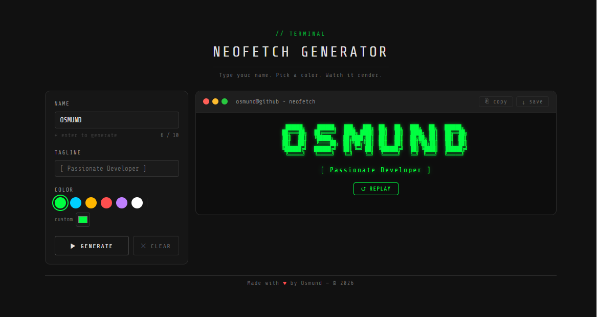

# 🖥️ Neofetch Generator

> Type your name. Pick a color. Watch it render.

A browser-based terminal nameplate generator. Enter any name (up to 10 characters), choose an accent color, and watch it animate column-by-column in a retro hacker terminal style - then copy the ASCII or save it as a PNG.

**[→ Live Demo](https://neofetch-generator.vercel.app/)**

## 📸 Preview

The animation also records beautifully as a GIF — great for GitHub profile READMEs, portfolio pages, or sharing on social. To capture it:

| Tool | Platform | Notes |
|------|----------|-------|
| [LICEcap](https://www.cockos.com/licecap/) | Windows, macOS | Simple, lightweight, records direct to GIF |
| [Kap](https://getkap.co/) | macOS | Clean UI, exports to GIF, MP4, WebM |
| [ScreenToGif](https://www.screentogif.com/) | Windows | Full editor, great control over frame rate and output size |
| [Peek](https://github.com/phw/peek) | Linux | Minimal GIF recorder for the desktop |

Hit **↺ replay** before recording so the animation starts fresh from the beginning.

## ✨ Features

- **Column-by-column animation** — renders like a real terminal, letter by letter across all rows simultaneously
- **Full A–Z Unicode font** — built from box-drawing characters (`█`, `╔`, `═`, `║`) with no external font libraries
- **6 color presets** — hacker green, cyan, amber, red, purple, white — plus a custom hex color picker
- **Copy ASCII** — copies the raw text art to clipboard, ready to paste into a GitHub README or bio
- **Download as PNG** — saves a 2x resolution screenshot of the terminal panel
- **Input validation** — rejects numbers and symbols with a clear error message
- **Fully responsive** — controls stack below the terminal on mobile
- **Zero dependencies** — vanilla HTML, CSS, and JavaScript (except html2canvas for PNG export)

## 📁 File Structure

neofetch-generator/
├── index.html        # App shell — layout, inputs, terminal panel
├── style.css         # All styling — terminal theme, panels, controls
└── js/
├── font.js       # A–Z Unicode box-drawing letter map (data only)
├── renderer.js   # Stitches letters into 6-row ASCII art arrays
└── animation.js  # Step engine, color, copy, download, validation

## 🛠️ Tech Used

| What | Why |
|------|-----|
| Vanilla JS | No framework overhead for a UI this size |
| CSS custom properties | Single-source theming, easy to extend |
| Share Tech Mono | Google Font — closest free match to a real terminal |
| html2canvas 1.4.1 | DOM-to-canvas for the PNG download feature |

## 👤 Author

Made with ♥ by **Osmund** — © 2026

## 📄 License

MIT — see [LICENSE](./LICENSE) for details.